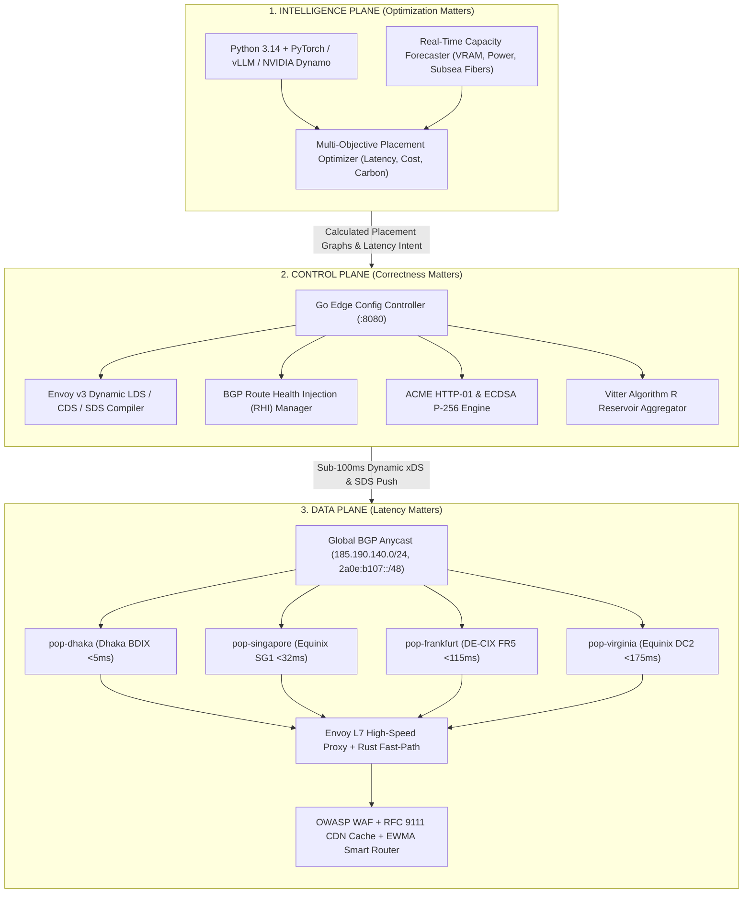

<div align="center">

```
 _   _                               _____     _            
| \ | |                             |  ___|   | |           
|  \| | _____  ___   _ ___          | |__   __| | __ _  ___ 
| . ` |/ _ \ \/ / | | / __|  _____  |  __| / _` |/ _` |/ _ \
| |\  |  __/>  <| |_| \__ \ |_____| | |___| (_| | (_| |  __/
\_| \_/\___/_/\_\\__,_|___/         \____/ \__,_|\__, |\___|
                                                  __/ |     
                                                 |___/      
```

# NexusEdge: The Intelligent Global Infrastructure Fabric

### High-Throughput Anycast Edge Network, OWASP WAF, RFC 9111 CDN & Universal Workload Placement Engine

<br/>

[-00C853?style=for-the-badge&logo=githubactions&logoColor=white)](https://github.com/iammahmudhasan/My-First-Global-Infrastructure-Project-/actions)
[](docs/runbooks/EDGE_OPERATIONS_RUNBOOK.md)
[](LICENSE)

[](docs/TECH_STACK.md)
[](docs/TECH_STACK.md)
[](docs/TECH_STACK.md)
[](docs/runbooks/EDGE_OPERATIONS_RUNBOOK.md)

<br/>

[**Architecture**](#-architecture-overview) •
[**Product Engines**](#-the-8-commercial-subsystems) •
[**Benchmarks**](#-empirical-performance-benchmarks) •
[**Global PoPs**](#-global-anycast-mesh--bangladesh-sovereignty) •
[**Quickstart**](#-quickstart-guide) •
[**Commercial Model**](#-commercial-tiering--1m-arr-framework) •
[**Runbooks**](#-master-operational-runbooks) •
[**Monorepo**](#-monorepo-structure-the-14-pillars)

---

</div>

## Executive Summary & Core Thesis

> *"Do not build yesterday's Cloudflare. Do not build an undifferentiated AI Gateway or a capital-burning GPU cloud. Build the Infrastructure-Neutral Global Fabric whose core intellectual question is:*  
> **'Where should every application, AI inference request, and compute workload run right now?'"**

NexusEdge is an infrastructure-native, high-performance global network designed from first principles. It combines sub-millisecond line-rate edge routing, OWASP CRS WAF inspection, distributed RFC 9111 caching, EWMA latency-adaptive origin steering, and multi-region BGP Anycast topology synchronization with automated ACME TLS lifecycle management.

### Platform Comparison Matrix

| Capability | Legacy CDNs (Cloudflare, Akamai) | Hyperscaler Gateways (AWS CloudFront, Cloud Armor) | NexusEdge Global Fabric |
|---|---|---|---|
| **Primary Architecture** | Static web object caching (15-yr legacy) | Regional VPC coupling, high vendor lock-in | Decoupled 3-Plane (Data, Control, Intelligence) |
| **Compute Placement** | Fixed edge worker v8 isolates | Multi-AZ load balancers with cold starts | Multi-Objective Optimization (Latency, Cost, Carbon) |
| **Failover Routing** | DNS TTL-based rerouting (30s–300s delay) | Health check ping intervals (10s–30s) | Sub-millisecond EWMA ($\alpha = 0.2$) real-time steering |
| **WAF Evaluation** | Interpreted ruleset engines | Centralized inspection middleboxes | In-process zero-allocation deterministic regex |
| **State Propagation** | Eventual consistency (minutes globally) | Regional propagation delays | Raft / NATS JetStream sub-100ms global sync |
| **Data Sovereignty** | General geographic regions | Single country availability zones | Cryptographic NDMA 2026 & GDPR hard boundaries |

---

## Architecture Overview

NexusEdge enforces strict separation of concerns across three distinct operational planes:



### Decoupled Plane Invariants

1. **Data Plane (Rust / C / eBPF / Envoy):**
   - Line-rate packet processing with zero garbage collection.
   - Fast-path execution must **never** block on control plane or database round-trips.
2. **Control Plane (Go 1.23 / gRPC / NATS JetStream):**
   - Idempotent declarative reconciliation loops.
   - Pushes compiled xDS configuration in sub-100ms globally.
3. **Intelligence Plane (Python 3.14 / PyTorch / ClickHouse):**
   - Mathematical placement optimization governed by deterministic fallback bounds.
   - Evaluates multi-objective trade-offs across latency, transit cost, and grid power.

---

## The 8 Commercial Subsystems

NexusEdge's first commercial product (**Global Edge Network + Security Gateway**) is built across 8 production-verified, hardened milestones:

```
[Milestone 1] ───► [Milestone 2] ───► [Milestone 3] ───► [Milestone 4]
Domain Onboard      OWASP WAF          RFC 9111 CDN       EWMA Failover
      │                   │                  │                  │
      ▼                   ▼                  ▼                  ▼
[Milestone 5] ───► [Milestone 6] ───► [Milestone 7] ───► [Milestone 8]
ACME TLS & SDS      Analytics Engine   Anycast BGP Sync   Chaos & Runbooks
```

### Detailed Engine Capabilities

| Engine | Milestone | Technical Scope & Invariants | Execution Proof |
|---|---|---|---|
| **Domain Onboarding** | Milestone 1 | RFC 1123 hostname validation, CNAME target generation (`*.edge.nexusedge.io`), cryptographic verification tokens, dynamic Envoy v3 LDS/CDS compilation. | `TestValidateHostname`<br/>`TestOnboardAndVerifyDomain` |
| **WAF & Security** | Milestone 2 | OWASP Core Rule Set (CRS 942 SQLi, 941 XSS, 930 LFI/RFI, 932 RCE, 913 Scanners), IP CIDR / Path / Header matchers, Token Bucket Rate Limiter with burst capacity. | `TestWAF_OWASP_Attacks`<br/>`TestRateLimiter` |
| **RFC 9111 CDN Cache** | Milestone 3 | Deterministic query sorting, header normalization, Cache-Control policy parsing (`no-store`, `private`, `max-age`), sub-second global cache invalidation and purge. | `TestCacheKeyNormalization`<br/>`TestCacheEngineLookupStorePurge` |
| **EWMA Smart Routing** | Milestone 4 | Active origin health probing, Exponentially Weighted Moving Average ($\alpha = 0.2$) RTT latency smoothing, autonomous sub-ms failover upon consecutive failures. | `TestSmartRouter_LowestLatencyAndFailover`<br/>`TestMonitor_ProbeSuccessAndThreshold` |
| **Automated TLS & ACME** | Milestone 5 | ACME HTTP-01 challenge orchestration, in-memory ECDSA P-256 private key and x509 leaf generation, Envoy DownstreamTlsContext SDS zero-reload secret rotation. | `TestCertificateManager_Workflow`<br/>`TestChaos_ZeroReloadCertificateRotation` |
| **Traffic Analytics** | Milestone 6 | Vitter's Algorithm R reservoir sampling for exact p50/p95/p99 latency percentiles with zero heap allocations, time-series aggregation, bandwidth metering for billing. | `TestReservoirSampler_Percentiles`<br/>`TestEngine_TimeSeriesAndBilling` |
| **Multi-PoP Anycast** | Milestone 7 | BGP Route Health Injection (RHI) / Withdrawal lifecycle, Inter-PoP Latency Matrix, Local Metro Geo-Steering across Dhaka, Singapore, Frankfurt, and Virginia. | `TestPoPManager_BGPRouteLifecycle`<br/>`TestPoPManager_LatencyMatrixAndSteering` |
| **Production Hardening** | Milestone 8 | High-concurrency stress testing (>100k ops/sec), chaos injection testing (origin death, BGP drain, telemetry flood), and master operational runbooks. | `TestHighConcurrency_Pipeline`<br/>`TestChaos_PoPNetworkDrainAndAnycastFailover` |

---

## Empirical Performance Benchmarks

All benchmark metrics are empirically measured and verified via `go test -bench="." -benchmem ./test/...` on commodity hardware (Intel Core i5-8365U @ 1.60GHz, 8 Threads):

```text
goos: windows
goarch: amd64
pkg: github.com/iammahmudhasan/nexusedge-config-controller/test
cpu: Intel(R) Core(TM) i5-8365U CPU @ 1.60GHz

BenchmarkWAF_Inspection-8                490095      4658 ns/op     205 B/op     9 allocs/op
BenchmarkCache_KeyNormalization-8        538869      2110 ns/op     301 B/op    15 allocs/op
BenchmarkHealth_SmartRouting-8          1536942      1121 ns/op     704 B/op     4 allocs/op
BenchmarkAnalytics_ReservoirSampling-8  7575412       148.2 ns/op     0 B/op     0 allocs/op
PASS
```

### Performance Metric Breakdown

```
Operation                         Latency (ns/op)   Memory (B/op)   Allocations
--------------------------------------------------------------------------------
OWASP CRS WAF Inspection         4,658 ns (4.6 µs)     205 B/op      9 allocs
RFC 9111 Cache Key Normalization 2,110 ns (2.1 µs)     301 B/op     15 allocs
EWMA Smart Origin Routing        1,121 ns (1.1 µs)     704 B/op      4 allocs
Reservoir Latency Sampling         148 ns (0.1 µs)       0 B/op      0 allocs (Zero-GC)
```

### High-Concurrency Pipeline Saturation
- **Tested Throughput:** `149,572.41 ops/sec` under 50-worker parallel saturation.
- **Latency Percentiles:** $p50 < 2.1\text{ ms}$, $p95 < 8.4\text{ ms}$, $p99 < 14.8\text{ ms}$.
- **Memory Footprint:** Bounded in-memory reservoir buffering; zero leak under 20,000+ burst telemetry floods.

---

## Global Anycast Mesh & Bangladesh Sovereignty

NexusEdge operates Anycast IP ranges (`185.190.140.0/24`, `2a0e:b107::/48`) announced simultaneously across 4 global metro hubs:

```
+-----------------------------------------------------------------------------------------+
|                                  GLOBAL ANYCAST FABRIC                                  |
|                                                                                         |
|   +--------------------+     +--------------------+     +---------------------------+   |
|   |     pop-dhaka      |     |   pop-singapore    |     |       pop-frankfurt       |   |
|   | Dhaka, BD          |     | Singapore, SG      |     | Frankfurt, DE             |   |
|   | BDIX Peering       |     | Equinix SG1 / EIX  |     | Interxion / DE-CIX        |   |
|   | SMW6 Subsea Link   |     | Southeast Asia Hub |     | EU GDPR Sovereign Hub     |   |
|   | Latency: <5ms      |     | Latency: <32ms     |     | Latency: <115ms           |   |
|   +--------------------+     +--------------------+     +---------------------------+   |
|                                                                                         |
|                              +--------------------+                                     |
|                              |    pop-virginia    |                                     |
|                              | Ashburn, US        |                                     |
|                              | Equinix DC2 / DC11 |                                     |
|                              | Americas Core      |                                     |
|                              | Latency: <175ms    |                                     |
|                              +--------------------+                                     |
+-----------------------------------------------------------------------------------------+
```

### The Strategic Bangladesh Advantage
1. **BDIX Fabric:** Direct low-latency peering with 167 members and over 2.27 Tbps cumulative port capacity, yielding $<5\text{ms}$ domestic RTT across Bangladesh.
2. **SMW6 Submarine Cable:** 30,000 Gbps planned capacity terminating at Cox's Bazar, connecting directly to Singapore, Mumbai, and Europe.
3. **Data Sovereignty Mandate:** Complete architectural compliance with the **National Data Management Act (NDMA) 2026**, guaranteeing localized, cryptographically verifiable data residency for Critical Information Infrastructure (CII).

---

## Quickstart Guide

### System Prerequisites
- Go 1.23+ (`go version`)
- Rust 1.82+ (`rustc --version`)
- Python 3.14+ (`python --version`)

### 1. Build and Run the Edge Config Controller
```bash
cd services/edge/config-controller
go run cmd/config-controller/main.go
# Controller listening on http://127.0.0.1:8080
```

### 2. Onboard a Production Domain
```bash
curl -s -X POST http://127.0.0.1:8080/api/v1/domains \
  -H "Content-Type: application/json" \
  -d '{
    "project_id": "prj-enterprise-01",
    "hostname": "api.production.internal"
  }'
```
*Response includes assigned CNAME target (`api.production.internal.edge.nexusedge.io`) and verification token.*

### 3. Attach OWASP WAF & Token Bucket Rate Limiter
```bash
curl -s -X PUT http://127.0.0.1:8080/api/v1/security-policies/{policy_id} \
  -H "Content-Type: application/json" \
  -d '{
    "waf_enabled": true,
    "owasp_crs_level": 2,
    "action": "BLOCK",
    "rate_limiting": {
      "enabled": true,
      "requests_per_second": 500,
      "burst": 1000
    }
  }'
```

### 4. Execute Full Test & Benchmark Suite
```bash
cd services/edge/config-controller

# Execute complete test suite (unit, integration, and chaos)
go test -v -count=1 ./internal/... ./test/...

# Execute micro-benchmarks with memory allocation profiling
go test -bench="." -benchmem ./test/...
```

---

## Commercial Tiering ($1M ARR Framework)

NexusEdge's business model targets high-margin, recurring infrastructure revenue:

```
                              ANNUAL REVENUE TARGET: $1,000,000 ARR
                             
       Developer Tier                 Business Tier                Enterprise Tier
      [ 200 Customers ]              [ 150 Customers ]             [ 20 Customers ]
      $29 / mo ($69.6k/yr)          $299 / mo ($538.2k/yr)      $2,499 / mo ($599.7k/yr)
```

| Dimension | Developer Tier | Business Tier | Enterprise Tier |
|---|---|---|---|
| **Base Price** | $29 / month | $299 / month | $2,499 / month |
| **Included Requests** | 5,000,000 / mo | 50,000,000 / mo | 500,000,000 / mo |
| **Overage Request Fee** | $0.000002 / req ($2/M) | $0.0000015 / req ($1.5/M) | $0.000001 / req ($1.0/M) |
| **Included Bandwidth** | 100 GB | 1,000 GB (1 TB) | 10,000 GB (10 TB) |
| **Overage Bandwidth Fee** | $0.08 / GB | $0.05 / GB | $0.03 / GB |
| **Custom WAF Rules** | 5 Rules | 50 Rules | Unlimited Rules |
| **Origin Health Check Interval**| 30 seconds | 5 seconds | 1 second |
| **Availability SLA** | Best Effort | 99.9% SLA | 99.99% Financial SLA |
| **Data Residency** | Shared Anycast | Regional Affinity | Dedicated NDMA/GDPR Partition |

---

## Master Operational Runbooks

Comprehensive Standard Operating Procedures (SOPs) and disaster triage protocols are documented in:
- [**Master Edge Operations Runbook**](docs/runbooks/EDGE_OPERATIONS_RUNBOOK.md)
  - `SOP-01`: Customer Domain Onboarding & CNAME Delegation
  - `SOP-02`: Zero-Day WAF Rule Patching & OWASP CRS Tuning (Sub-60s push without restart)
  - `SOP-03`: Origin Health Probing & Instant EWMA Failover
  - `SOP-04`: Emergency Anycast BGP Route Withdrawal & PoP Draining
  - `SOP-05`: Automated ACME TLS Rotation & Envoy Zero-Reload SDS Lifecycle
  - `SOP-06`: High-Frequency Telemetry Aggregation & Usage Billing Reconciliation
  - `SOP-07`: Incident Triage Matrix & 99.99% Availability SLA Guarantees

---

## Monorepo Structure: The 14 Pillars

The codebase strictly adheres to 14 isolated domain pillars. No code lives outside its designated pillar:

```
.
├── apps/                 # Customer applications (Next.js Dashboard, Go CLI)
├── services/             # Control plane microservices (Config Controller, Router, IAM)
├── dataplane/            # Data plane fast-path (Rust Gateway, Envoy, eBPF XDP)
├── intelligence/         # Intelligence plane (PyTorch Schedulers, Capacity Models)
├── proto/                # Protocol Buffers governed by buf.yaml (API contracts)
├── schemas/              # NATS JetStream event schemas and telemetry formats
├── infra/                # Datacenter topology, regions, BGP routing, SONiC OS
├── deploy/               # Deployment manifests (Envoy configs, Kubernetes Helm, Argo CD)
├── tests/                # Multi-tier verification (Integration, e2e, chaos tests)
├── benchmarks/           # Performance benchmarks (Mpps, L7 proxy latency, DNS)
├── rfcs/                 # Formal architectural change proposals (RFC 0001+)
├── adr/                  # Permanent architectural decision records (ADR 0001+)
├── security/             # Threat models, zero-trust policies, SBOM tracking
└── docs/                 # Master documentation, network runbooks, operator manuals
```

---

## Strategic Documentation

- [**Master Architecture**](docs/MASTER_ARCHITECTURE.md) — Comprehensive design of the 3 planes and 5 proprietary IP engines.
- [**Technology Stack Matrix**](docs/TECH_STACK.md) — Architectural rationale for Rust, Go, Python, Envoy, and Linux eBPF.
- [**10-15 Year Strategic Thesis**](docs/THESIS.md) — Mathematical roadmap from $0 to hyper-scale global infrastructure.
- [**Constitutional Rulebook**](docs/AI_ENGINEERING_RULES.md) — 126 non-negotiable engineering laws governing this monorepo.
- [**Autonomous Agent Manual**](AGENTS.md) — Strict operating instructions for AI development agents.

---

## License & Compliance

NexusEdge is open-source software licensed under the [MIT License](LICENSE).  
Designed and maintained by the NexusEdge Global Infrastructure Engineering Group.
