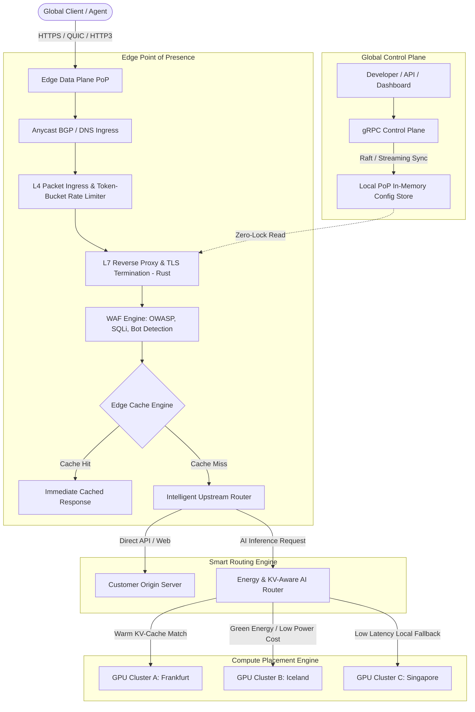

# Platform Architecture & Technical Blueprint

This document specifies the technical design, protocols, subsystem interfaces, and engineering invariants of the **Global Infrastructure Fabric (Stage 1 to Stage 5)**.

---

## 1. High-Level Subsystem Architecture

The platform is strictly decoupled into three layers:
1. **The Edge Data Plane (High-Throughput / Zero-Cost Runtime in Rust)**
2. **The Control Plane (Globally Replicated Declarative State)**
3. **The Intelligent AI & Energy Router (State-Aware Workload Placement)**



---

## 2. Edge Data Plane Components (Stage 1)

### A. L7 Reverse Proxy Engine
- **Engine Language:** Rust with asynchronous I/O (`tokio`, `hyper`, `bytes`).
- **Connection Multiplexing:** HTTP/1.1, HTTP/2, and HTTP/3 (QUIC).
- **Zero-Allocation Routing:** Path matching, header rewriting, and upstream connection pooling using non-blocking connection pools.

### B. DDoS & Token-Bucket Rate Limiter
- **Algorithm:** In-memory lock-free Token Bucket with sliding window counters.
- **Granularity:** Per-client IP, per-ASN, per-API-key, and global ingress rate limits.
- **Burst Mitigation:** Soft-throttling with HTTP `429 Too Many Requests` or challenge emission.

### C. Web Application Firewall (WAF)
- **Signature & Anomaly Scoring:**
  - SQL Injection (SQLi) regex and token-based detectors.
  - Cross-Site Scripting (XSS) pattern evaluators.
  - Path Traversal (`../`, encoded bytes) shields.
  - Malicious User-Agent / known malicious scanner fingerprinting.
- **Performance Budget:** Under **150 microseconds (μs)** inspection overhead per request.

### D. Edge Caching Engine
- **Storage Hierarchy:** In-memory LRU cache with TTL expiration.
- **Cache-Control Adherence:** Strict adherence to `public`, `max-age`, `s-maxage`, `stale-while-revalidate`.
- **Cache Keys:** Normalized URL paths, query parameters, and custom header variants (`Vary`).

---

## 3. Intelligent AI & Energy Router Specification (Stage 5 Evolution)

Unlike conventional load balancers that dispatch requests using simple Round Robin or Least Connections, the **AI Router** optimizes a multi-objective cost function:

$$\text{Score}(N_i) = w_1 \cdot \text{Latency}(N_i) + w_2 \cdot \text{Cost}(N_i) + w_3 \cdot \text{Carbon}(N_i) - w_4 \cdot \text{KV\_Warmth}(N_i)$$

Where:
- $\text{Latency}(N_i)$: Network round-trip time between edge node and GPU node $N_i$.
- $\text{Cost}(N_i)$: Spot/on-demand price per GPU compute second at region $N_i$.
- $\text{Carbon}(N_i)$: Current grid carbon intensity ($gCO_2eq / kWh$) of the hosting facility.
- $\text{KV\_Warmth}(N_i)$: Cache affinity indicating if the model or conversation history prompt prefix is already loaded in the VRAM of node $N_i$.

---

## 4. Multi-PoP Deployment Topology (Stage 2)

```
                    ┌─────────────────────────┐
                    │  Anycast Virtual IP     │
                    │  (e.g., 185.x.x.x)      │
                    └────────────┬────────────┘
         ┌───────────────────────┼───────────────────────┐
         │                       │                       │
┌─────────────────┐     ┌─────────────────┐     ┌─────────────────┐
│  PoP: Singapore │     │  PoP: Frankfurt │     │  PoP: Virginia  │
├─────────────────┤     ├─────────────────┤     ├─────────────────┤
│ • Edge Gateway  │     │ • Edge Gateway  │     │ • Edge Gateway  │
│ • Local Cache   │     │ • Local Cache   │     │ • Local Cache   │
│ • WireGuard Mesh│     │ • WireGuard Mesh│     │ • WireGuard Mesh│
└────────┬────────┘     └────────┬────────┘     └────────┬────────┘
         │                       │                       │
         └───────────────────────┴───────────────────────┘
                                 │
                   Encrypted WireGuard Overlay
                                 │
                    ┌─────────────────────────┐
                    │  Customer Origin / Core │
                    │   (AWS / GCP / Bare)    │
                    └─────────────────────────┘
```

---

## 5. Directory & Monorepo Structure

```text
├── core/
│   ├── gateway/                 # High-performance Edge Proxy in Rust (Stage 1 Core)
│   │   ├── src/
│   │   │   ├── main.rs          # Server entry point & async runtime runner
│   │   │   ├── config.rs        # Hot-reloading declarative config models
│   │   │   ├── proxy.rs         # L7 reverse proxy connection pool & dispatcher
│   │   │   ├── rate_limit.rs    # Token-bucket sliding window rate limiter
│   │   │   ├── waf.rs           # Web Application Firewall pattern matcher
│   │   │   ├── cache.rs         # High-speed in-memory LRU cache
│   │   │   └── router.rs        # Upstream selection, health checks & metrics
│   │   └── Cargo.toml           # Rust package dependencies (tokio, hyper, etc.)
│   └── control-plane/           # Cluster config orchestrator & state sync
├── deploy/
│   ├── docker-compose.yml       # Local multi-PoP & origin testbed
│   └── terraform/               # Multi-cloud multi-region provisioning scripts
├── docs/
│   ├── THESIS.md                # 10-15 Year Strategic Vision & Macro Market Analysis
│   └── ARCHITECTURE.md          # Technical specifications and RFCs
└── README.md                    # Project overview, quickstart & roadmap
```
