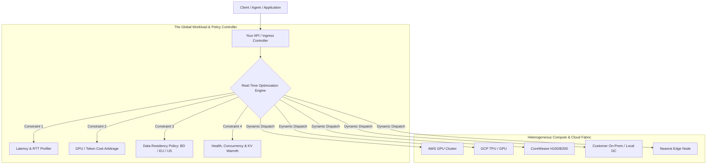

# Global Infrastructure Thesis: The Falsified & Refined Strategic Blueprint

> **"Do not build yesterday's Cloudflare. Do not build an undifferentiated AI Gateway or a capital-burning GPU cloud. Build the Infrastructure-Neutral Global Fabric whose core intellectual question is: 'Where should every application, AI inference request, and compute workload run right now?'"**

---

## 1. The Falsification: Why the Obvious Ideas Fail

A rigorous analysis of current market incumbents (2025–2026) reveals that the "obvious" startup ideas are already commoditized, capital-trapped, or fiercely defended by incumbents with insurmountable moats:

```
┌─────────────────────────┬─────────────────────────────────────────────────────────────────┐
│ The Trap                │ Why It Fails (The Reality Check)                                │
├─────────────────────────┼─────────────────────────────────────────────────────────────────┤
│ ❌ "We will build a CDN" │ Cloudflare (330+ cities, 405+ Tbps, 81M+ req/sec) and Akamai    │
│                         │ ($4.21B revenue, 4,400+ PoPs) make generic CDNs capital-fatal.   │
├─────────────────────────┼─────────────────────────────────────────────────────────────────┤
│ ❌ "Just an AI Gateway"  │ Cloudflare AI Gateway, Akamai AI Grid, and Google Distributed   │
│                         │ Cloud already offer generic LLM API routing. No defensible moat.│
├─────────────────────────┼─────────────────────────────────────────────────────────────────┤
│ ❌ "We will build a GPU │ CoreWeave ($5B+ revenue, 3.1 GW contracted power, 43 DCs) and   │
│     Cloud"              │ hyperscalers have billions in CapEx. Impossible to out-spend.   │
├─────────────────────────┼─────────────────────────────────────────────────────────────────┤
│ ❌ "Build a Data Center │ Premature CapEx trap for a software startup. Alphabet spent     │
│     First"              │ $91.4B on CapEx in 2025 alone.                                  │
└─────────────────────────┴─────────────────────────────────────────────────────────────────┘
```

---

## 2. The Real White Space: The Infrastructure-Neutral Global Fabric

Instead of owning the physical silicon and fiber on Day 1, the platform acts as the **Intelligent Workload & Traffic Operating System** across heterogeneous infrastructure.

The customer never asks:
> *"Provision an instance in AWS us-east-1 or GCP Singapore."*

The customer states their policy:
> *"Run this reasoning model and data workload globally, respecting my budget of $0.002/query, max P95 latency of 30ms, with strict Bangladesh/EU data residency guarantees."*



---

## 3. The 6-Layer Progressive Moat

A global infrastructure company is not built in reverse. It is built in a disciplined, self-funding sequence where each layer finances and justifies the next:

```
Layer 1: Software & Policy Engine (Zero Capex, High Margins)
   │
   ▼
Layer 2: Customer Workload Density (Capturing Mission-Critical Traffic)
   │
   ▼
Layer 3: Global Traffic Intelligence (Proprietary Telemetry & Routing Graph)
   │
   ▼
Layer 4: Network & PoP Mesh (First PoPs in Singapore, Dhaka, Frankfurt, Virginia)
   │
   ▼
Layer 5: Edge Compute Footprint (Wasm / MicroVMs on Dedicated Metal)
   │
   ▼
Layer 6: Physical Infrastructure & Peering (Own ASN, BGP Anycast, IXP Peering)
```

---

## 4. The 10–15 Year Execution Roadmap

### Phase 0: 0–12 Months (The First $1M ARR Product)
- **Product:** **Global AI & Compute Traffic Controller (Multi-Cloud / Multi-GPU)**.
- **Core Capabilities:**
  - Multi-provider abstraction (AWS, Azure, GCP, CoreWeave, On-Prem).
  - Dynamic policy routing: Latency, Cost arbitrage, SLA uptime, and Data Residency.
  - Real-time observability, health checking, and circuit breaking.
  - Zero CapEx. Pure high-gross-margin software recurring revenue.
- **Economics:**
  - $1,000,000 ARR = 100 enterprise customers × $10,000 ARR (or 200 × $5,000 ARR).

### Phase 1: 1–3 Years (Edge Software & First Regional PoPs)
- In-house Anycast DNS, high-throughput L7 Reverse Proxy (Rust), and WAF.
- First PoP locations deployed in **Dhaka, Singapore, Frankfurt, Virginia, Mumbai**.
- Software running on leased colocation and virtual instances connected via WireGuard mesh.

### Phase 2: 3–5 Years (Autonomous Network & Peering)
- Acquisition of own **ASN (Autonomous System Number)** and IPv4/IPv6 blocks.
- Direct **BGP Anycast** peering at major IXPs (including BDIX, Equinix, DE-CIX).
- Drastic reduction of upstream transit costs through settlement-free peering.

### Phase 3: 5–8 Years (Edge AI & Sovereign Cloud)
- Distributed GPU inference orchestration at the edge.
- S3-compatible sovereign distributed storage and KV-cache synchronization.
- Turnkey sovereign cloud appliance for regulated industries (Banking, Health, National Security).

### Phase 4: 8–15 Years (The Unified Global Fabric)
- Deep integration with green power grids (dynamic carbon-aware compute migration).
- Full global infrastructure operating system competing with hyperscalers on orchestration efficiency.

---

## 5. Strategic Geo-Advantage: Bangladesh as R&D & Sovereign Anchor

Starting from Bangladesh provides distinctive, verified structural advantages when leveraged correctly:

1. **Substantial Connectivity Infrastructure:**
   - 8 active IXPs; **BDIX** has 167+ members with 2.27+ Tbps cumulative member port capacity.
   - **SMW6 Submarine Cable** (30,000 Gbps planned capacity) connecting Cox's Bazar to Singapore, Mumbai, and France.
2. **Regulatory Positioning & Data Sovereignty:**
   - The **National Data Management Act (2026)** and personal-data regulations mandate that critical information infrastructure (CII) and restricted personal data must maintain a synchronized real-time copy within national borders.
   - We offer organizations a **Global-Grade Infrastructure + Cryptographic Local Sovereignty Guarantee**, solving compliance headaches for banks, fintechs, and government enterprises.
3. **Regulatory Strategy (Avoiding Licensing Traps):**
   - We do not start by becoming a licensed ISP, IIG, or NTTN.
   - We deliver an overlay software platform utilizing existing licensed transit and colocation providers, formalizing carrier relationships only as traffic volume warrants.
