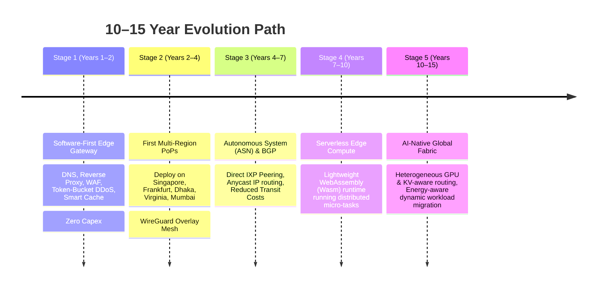

# Global Infrastructure Thesis: The Next 10–15 Years

> **"Do not build yesterday's Cloudflare. Build the infrastructure that unites Network, Distributed Compute, Storage, AI Inference Routing, Energy Awareness, and Data Sovereignty into a single unified global fabric."**

---

## 1. Executive Summary & The Structural Shift

The foundational architecture of the Internet is undergoing its most radical transformation since the transition from centralized mainframes to hyperscale cloud data centers. Between 2026 and 2040, five irreversible structural forces are reshaping the global digital substrate:

```mermaid
graph TD
    subgraph Old [Legacy Paradigm (2010–2024)]
        U1[User] -->|Transit / Public Internet| DC[Central Hyperscale Cloud<br/>US-East-1 / EU-Central]
    end

    subgraph Emerging [Emerging Paradigm (2026–2040)]
        U2[User / Agent] --> E1[Nearest Edge / PoP<br/>< 10ms Latency]
        E1 --> E2[Edge Compute & Wasm Engine]
        E2 -->|KV-Cache & State Routing| RC[Regional Sovereign Cloud<br/>Data Residency Compliant]
        RC -->|Backbone / Transit| CC[Core High-Density Compute<br/>Grid & Energy Optimized]
    end
```

### The 5 Structural Changes

| Force | Driver | Architectural Consequence |
|---|---|---|
| **1. Hyper-Distribution** | Google Cloud (43 regions, 200+ edge locations) & Cloudflare (330+ cities, 500 Tbps) | Centralized compute is dead for user-facing and agentic workloads. Edge PoPs act as the front door. |
| **2. AI Traffic Asymmetry** | Reasoning models, multi-turn agents, distributed KV-caching | Requests are no longer static HTTP round-trips; they are dynamic, stateful multi-node inference graphs. |
| **3. Compute-Network Convergence** | Edge runtimes (Workers), distributed object storage (R2/S3), durable objects | Network, compute, and storage cannot be separate silos; they operate as one integrated runtime. |
| **4. Geopolitical & Sovereign Cloud** | Sovereign IaaS spending exceeding $80B+ (Gartner), EU AI & Cloud Acts | Physical location, legal jurisdiction, and isolation are hard technical constraints in routing tables. |
| **5. Power & Grid Constraints** | Data center electricity demand doubling by 2030 (IEA), 20% capacity delayed by grid | Compute must dynamically migrate to where power is cheap, green, and grid-connected. |

---

## 2. The AI Infrastructure Evolution: Training vs. Agentic Inference

```mermaid
flowchart TD
    subgraph Legacy_AI [Legacy Static Inference]
        A[User Request] --> B[API Gateway] --> C[GPU Node] --> D[Token Stream Out]
    end

    subgraph Agentic_AI [Modern Multi-Hop Agentic Inference]
        UA[User / Autonomous Agent] --> ER[Intelligent Edge Router]
        ER -->|Affinity / KV Warm| GA[GPU Cluster A: Small Reasoning Model]
        GA -->|Tool Call / Query| DB[Edge Database / Search]
        DB -->|Context Retrieval| GB[GPU Cluster B: Large MoE Foundation]
        GB -->|Multi-Node Synthesizer| GC[GPU Cluster C: Verifier / Safety]
        GC --> UA
    end
```



### The Reality of Modern Inference
1. **Agentic Loops:** A single user query spawns 5–20 internal inference calls across tools, models, and verifiers.
2. **KV-Cache Locality:** Re-evaluating 128k prompt context across GPUs wastes 80% of compute. Routing must be **KV-cache aware**.
3. **Edge Pre-processing:** 90% of enterprises require local edge filtering, tokenization, and privacy sanitization before routing to deep GPU clusters.

---

## 3. The 5 Unsolved Infrastructure Problems

### Problem A: Energy & Grid-Aware Compute Placement
- Power density for AI clusters has surged from 10 kW/rack to **100–200+ kW/rack**.
- **Unsolved:** Dynamically routing batch training and non-real-time inference jobs to regions with active surplus renewable energy (curtailed solar/wind) while maintaining ultra-low-latency real-time inference near users.

### Problem B: AI Inference Network Topology
- Traditional Load Balancers (Round Robin, Least Connections) are blind to GPU state.
- **Unsolved:** A network layer that understands model weight loading, GPU memory saturation, KV-cache residency, and inter-node tensor parallel interconnects.

### Problem C: Unified Multi-Cloud Sovereign Mesh
- Companies face contradictory requirements:
  - *Must run within 15ms of Tokyo users.*
  - *Must store customer data exclusively in Frankfurt (GDPR/BSI).*
  - *Must not suffer vendor lock-in to AWS/GCP.*
- **Unsolved:** A single declarative control plane running across heterogeneous bare-metal, colocation, and hyperscale cloud providers with cryptographic data residency guarantees.

### Problem D: Submarine Cable & Physical Resilience
- Over 99% of international traffic traverses submarine fiber cables.
- **Unsolved:** Software-defined automated multipath rerouting around cable cuts, geopolitical choke points, and IXP degradations without BGP convergence delays.

### Problem E: Developer Cognitive Overload
- Today, architects juggle 12+ fragmented services: DNS, CDN, DDoS mitigation, K8s, GPUs, Vector DBs, Storage, TLS, IAM, and Observability.
- **Unsolved:** A developer-friendly global substrate where deploying code automatically provisions network, compute, caching, and security globally.

---

## 4. Market Matrix: The Incumbents vs. The Opportunity

```
                        ┌───────────────────────────────────────────────┐
                        │               THE $10B+ TARGET                │
                        │         Unified AI-Native Global Fabric       │
                        │ (Network + Compute + AI Routing + Sovereign)  │
                        └───────────────────────▲───────────────────────┘
                                                │
         ┌───────────────────────┬──────────────┴────────┬───────────────────────┐
         │                       │                       │                       │
┌─────────────────┐     ┌─────────────────┐     ┌─────────────────┐     ┌─────────────────┐
│   Cloudflare    │     │       AWS       │     │     Google      │     │    Microsoft    │
├─────────────────┤     ├─────────────────┤     ├─────────────────┤     ├─────────────────┤
│ • 330+ Cities   │     │ • 39 Regions    │     │ • Deep AI TPUs  │     │ • Enterprise AI │
│ • L7 Edge Proxy │     │ • Central Cloud │     │ • Global Fiber  │     │ • Azure Cloud   │
│ • Strong CDN/WAF│     │ • Massive DBs   │     │ • Search scale  │     │ • 400+ DCs      │
│ ✕ Limited Heavy │     │ ✕ Complex Edge  │     │ ✕ High egress   │     │ ✕ Legacy debt   │
│   GPU compute   │     │ ✕ Expensive net │     │ ✕ Developer UX  │     │ ✕ Fragmented    │
└─────────────────┘     └─────────────────┘     └─────────────────┘     └─────────────────┘
```

**The Strategic Gap:** No existing provider seamlessly unites low-latency edge protection with intelligent AI routing, energy-conscious compute placement, and sovereign data isolation under a single unified, developer-first operating system.

---

## 5. The 10–15 Year Execution Roadmap: From $0 to Hyper-Scale



### Stage 1: The First $1M Revenue Product (Software-First Gateway)
- **Zero Heavy Capex:** Runs on commodity VMs, Hetzner, AWS, GCP, or bare-metal instances.
- **Customer Value Proposition:** *"Point your DNS to our network. We instantly eliminate DDoS, block malicious bot traffic, cache assets globally, and accelerate your origin by up to 60%."*
- **Core Components:**
  1. High-Performance L7 Reverse Proxy (Built in Rust).
  2. Rule-based Web Application Firewall (WAF).
  3. Distributed Token-Bucket Rate Limiter & DDoS Mitigation.
  4. Dynamic Cache Engine with Cache-Tag Invalidation.
  5. GeoDNS & Health Checking Engine.
